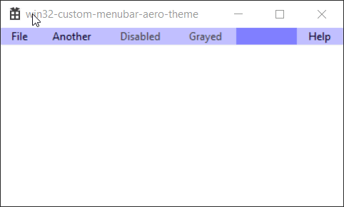
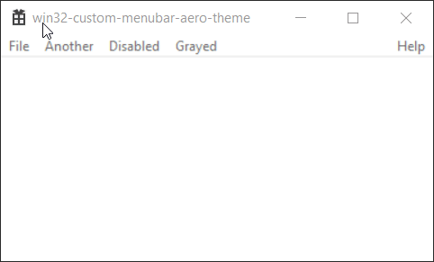

# win32-custom-menubar-aero-theme
Custom owner menubar drawing for win32 even with aero themes using undocumented Windows messages and structures, previously unknown.




## Summary
Drawing the menubar is handled by Windows, but does not expose an owner-draw or custom draw interface the same way that popup menus do. However, undocumented messages are sent to the window which are handled by uxtheme.dll via DefWindowProc to implement menubar drawing, which we can override to implement custom drawing and measurement.

This can be used to implement custom colors and drawing in the menubar, including images if desired. Additionally, simply using the MENU_POPUPITEM instead of MENU_BARITEM theme part for the drawing will take advantage of the native dark mode themes that Explorer uses (see [win32-darkmode](https://github.com/ysc3839/win32-darkmode) since the dark mode themes only affect the popup menu parts but not the menubar parts.

Relevant information is in [UAHMenuBar.h](UAHMenuBar.h) as well as a sample WndProc handler in [UAHMenuBar.cpp](UAHMenuBar.cpp) showing custom drawing. This was added to the most basic sample application from Visual Studio 2019 as the example application.

```c
#define WM_UAHDRAWMENU         0x0091	// lParam is UAHMENU
#define WM_UAHDRAWMENUITEM     0x0092	// lParam is UAHDRAWMENUITEM
#define WM_UAHMEASUREMENUITEM  0x0094	// lParam is UAHMEASUREMENUITEM

// describes the sizes of the menu bar or menu item
typedef union tagUAHMENUITEMMETRICS
{
	struct {
		DWORD cx;
		DWORD cy;
	} rgsizeBar[2];
	struct {
		DWORD cx;
		DWORD cy;
	} rgsizePopup[4];
} UAHMENUITEMMETRICS;

// not really used in our case but part of the other structures
typedef struct tagUAHMENUPOPUPMETRICS
{
	DWORD rgcx[4];
	DWORD fUpdateMaxWidths : 2; // from kernel symbols, padded to full dword
} UAHMENUPOPUPMETRICS;

// hmenu is the main window menu; hdc is the context to draw in
typedef struct tagUAHMENU
{
	HMENU hmenu;
	HDC hdc;
	DWORD dwFlags; // no idea what these mean, in my testing it's either 0x00000a00 or sometimes 0x00000a10
} UAHMENU;

// menu items are always referred to by iPosition here
typedef struct tagUAHMENUITEM
{
	int iPosition; // 0-based position of menu item in menubar
	UAHMENUITEMMETRICS umim;
	UAHMENUPOPUPMETRICS umpm;
} UAHMENUITEM;

// the DRAWITEMSTRUCT contains the states of the menu items, as well as
// the position index of the item in the menu, which is duplicated in
// the UAHMENUITEM's iPosition as well
typedef struct UAHDRAWMENUITEM
{
	DRAWITEMSTRUCT dis; // itemID looks uninitialized
	UAHMENU um;
	UAHMENUITEM umi;
} UAHDRAWMENUITEM;

// the MEASUREITEMSTRUCT is intended to be filled with the size of the item
// height appears to be ignored, but width can be modified
typedef struct tagUAHMEASUREMENUITEM
{
	MEASUREITEMSTRUCT mis;
	UAHMENU um;
	UAHMENUITEM umi;
} UAHMEASUREMENUITEM;
```

### 0x0091 WM_UAHDRAWMENU

This message is sent to draw the menu bar background. The LPARAM is a UAHMENU pointer.

Draw the background into hdc. The menu bar rect can be calculated by using GetMenuBarInfo to get the rcBar, GetWindowRect to get the window rect, and then OffsetRect(rcBar, -rcWindow.left, -rcWindow.top).

### 0x0092 WM_UAHDRAWMENUITEM

This message is sent to draw an individual menu item. The LPARAM is a UAHDRAWMENUITEM pointer.

The zero-based position of the menu item is in umi.iPosition. Draw the background and text into um.hdc using the rectangle in dis.rcItem. The state of the menu item is in dis.itemState, generally a combination of any (ODS_DEFAULT | ODS_INACTIVE | ODS_HOTLIGHT | ODS_SELECTED | ODS_GRAYED | ODS_DISABLED | ODS_NOACCEL)

### 0x0094 WM_UAHMEASUREMENUITEM

This message is sent to measure an individual menu item. The LPARAM is a UAHMEASUREMENUITEM pointer.

Forwarding this to DefWindowProc will fill in the values as expected, which is all you need if you are simply changing background colors or etc and not messing with the width. The MEASUREITEMSTRUCT is intended to be filled in with the size of the text.


## History
Many years ago, a brush could be specified for the background in the `MENUINFO` structure, but this no longer became possible with visual themes. Nonclient drawing like the titlebar and menubar was handled within user32 in kernel mode, but this was moved out of there when visual themes started being used. In order to handle this in user mode, these special messages are sent to the main window, which are handled by DefWindowProc (which ends up calling _ThemeDefWindowProcW).

By setting a breakpoints on DrawThemeText and DrawThemeBackground etc in a simple test application, eventually I saw CThemeMenuBar::DrawItem and CThemeMenuBar::DrawClientArea in the callstack, which was the eureka moment. Searching the web showed some references to these windows messages, and the WM_ names of them, but no information at all about what they do. The function signatures of these in uxtheme.dll provided some hints to the types of structures we are dealing with, such as tagUAHDRAWMENUITEM. Using public symbols, we can determine some basic information about these structures, such as the member names and their size. Debugging and trial and error and intuition allowed me to fill in the missing details.